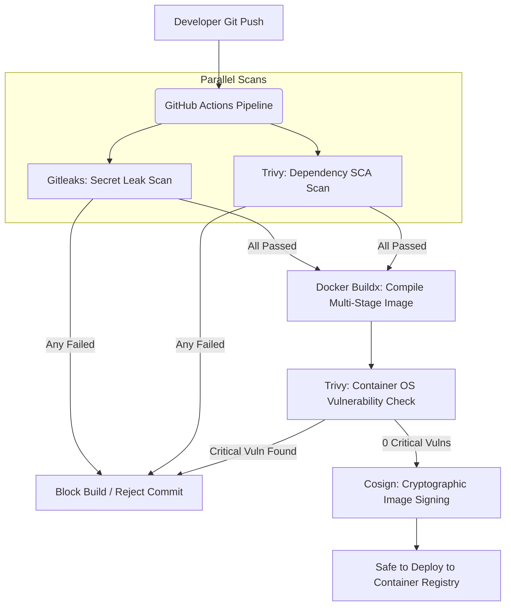

# Enterprise DevSecOps CI/CD Pipeline & Container Security

[](https://github.com/arshad0126/devsecops-container-pipeline/actions)
[](https://opensource.org/licenses/MIT)

An enterprise-grade **DevSecOps repository** showcasing security-hardened containerization and automated pipeline check gates for a modern **React application** using **Gitleaks**, **Trivy**, **Nginx (Non-Root)**, and **Cosign**.

This project models secure "Shift-Left" software packaging by automatically scanning source code for secrets, auditing dependencies for vulnerabilities, verifying container image layers, and preparing cryptographic signatures before production release.

---

## 🏗️ DevSecOps Pipeline Flow

The diagram below details the automated verification stages executed on every commit to ensure no vulnerabilities or credentials bypass deployment gates:



---

## 🔒 Hardened Non-Root Container Architecture

Running containers as `root` is one of the most common critical security findings in Kubernetes and cloud environments. If a hacker exploits a vulnerability in a root container, they can take over the host operating system.

This repository implements a **fully hardened Nginx container** with the following security features:

### 1. Non-Root Execution Enforced
- The container runs under the default unprivileged `nginx` user (**UID 101**) instead of `root`.
- Standard Nginx write paths are explicitly mapped and owned by the `nginx` user:
  ```dockerfile
  RUN chown -R nginx:nginx /usr/share/nginx/html && \
      chown -R nginx:nginx /var/cache/nginx && \
      chown -R nginx:nginx /var/log/nginx && \
      chown -R nginx:nginx /etc/nginx
  ```

### 2. Custom Port Binding (8080)
- Unprivileged users cannot bind to ports below 1024. Nginx is configured to listen on port **`8080`** rather than standard port `80`.

### 3. Log Mapping & Server Hardening
- **Logs:** System logs are redirected to standard output (`/dev/stdout`) and standard error (`/dev/stderr`), aligning with cloud-native logging practices.
- **Tokens Disabled:** Nginx is configured with `server_tokens off` to disable outputting the Nginx version in HTTP headers, preventing hackers from searching for version-specific exploits.
- **Temp Write Path:** Nginx's PID file is moved to `/tmp/nginx.pid` so it can be written to without root credentials.

### 4. Custom Security Headers Enforced
The Nginx configuration injects strict compliance headers:
- `X-Frame-Options: DENY` (prevents clickjacking attacks).
- `X-Content-Type-Options: nosniff` (forces browsers to respect MIME types).
- `X-XSS-Protection: 1; mode=block` (mitigates cross-site scripting).
- **Content Security Policy (CSP):** Restricts asset fetches strictly to the local origin and trusted fonts/styles.

---

## 🚀 CI Pipeline Audit Gates

Our GitHub Actions workflow (`.github/workflows/devsecops-pipeline.yml`) runs the following scanners on every push:

1. **Secret Scanning (Gitleaks):** Scans git history to detect committed credentials, private keys, or API tokens.
2. **Software Composition Analysis (Trivy SCA):** Audits npm packages in `package.json` for known vulnerabilities, alerting developers of high-risk libraries.
3. **Container Image Scan (Trivy):** Scans the layers of the compiled image for OS-level vulnerabilities (e.g. within Alpine base packages). **If any `CRITICAL` vulnerability is found, the pipeline fails and blocks push.**
4. **Cosign Image Signing:** Prepares keyless container signing (Sigstore/OIDC) to cryptographically prove image origin and integrity.

---

## 💻 Local Execution Guide

### Prerequisites
- [Docker Desktop](https://www.docker.com/products/docker-desktop/)

### 1. Build the Secure Image Locally
```bash
docker build -t devsecops-dashboard-app:latest .
```

### 2. Run the Container
Run the container, binding port 8080 to your local machine:
```bash
docker run -d -p 8080:8080 --name secure-dashboard devsecops-dashboard-app:latest
```

### 3. Verify Non-Root User Execution
Query the running container processes to prove it is executing under the unprivileged `nginx` user and not `root`:
```bash
docker exec secure-dashboard whoami
# Output should return: nginx

docker exec secure-dashboard id
# Output should return: uid=101(nginx) gid=101(nginx) groups=101(nginx)
```
Open your browser and navigate to `http://localhost:8080` to interact with the security audit dashboard.
